# CarboncraftModelV2
CarboncraftModelV2是低碳打卡与建造游戏“Carboncraft”配套的**低碳行为视觉识别CoreML模型**，它使用CreateML训练，具有**轻量、快速、识别类型涵盖生活常见低碳场景**等特点。

# 标签
CarboncraftModelV2可以识别生活中十余种常见低碳场景，其原理是通过识别不同场景中的物体来对低碳行为分类。
| 标签 | 描述 | 训练使用图片数     |
|:-----|:----|:------:   |
|pubTraffic_bus | 公交车   | 500   |
|pubTraffic_subway | 地铁   | 500   |
|pubTraffic_boat | 轮渡   | 500   |
|pubTraffic_train | 火车/高铁   | 500   |
|pubTraffic_coach | 长途汽车   | 500   |
|bike | 自行车   | 500   |
|eleBike | 电动车   | 500   |
|shopBag | 使用环保购物袋   | 500   |
|waterbottle | 不使用一次性水杯   | 500   |
|trash | 垃圾分类   | 500   |
|homePlant | 家庭种植   | 500   |
|lunchBox | 不使用一次性饭盒   | 500   |
|mac_mini_m4 | 使用碳中和电子产品（Mac mini(M4)）   | 500   |
|apple_watch | 使用碳中和电子产品（Apple Watch）   | 500   |

# 拍照识别示例
## pubTraffic_bus
可拍摄公交车车身，如下图：
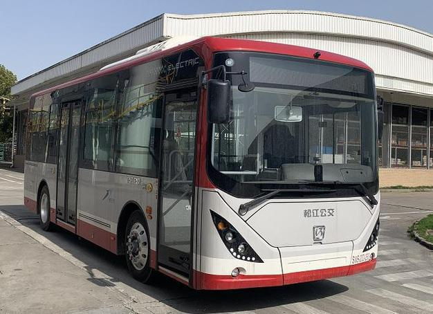

## pubTraffic_subway
可拍摄地铁站或车厢内部，如下图：
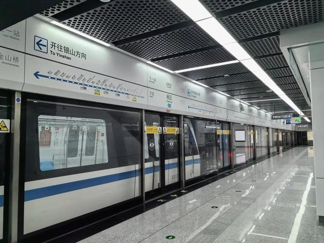

## pubTraffic_boat
可拍摄船体或水域，如下图：

## pubTraffic_train
可拍摄高铁/火车车身，如下图：
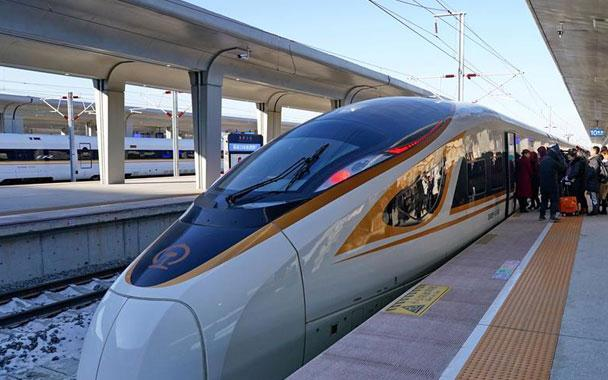

## pubTraffic_coach
可拍摄长途汽车车身，如下图：
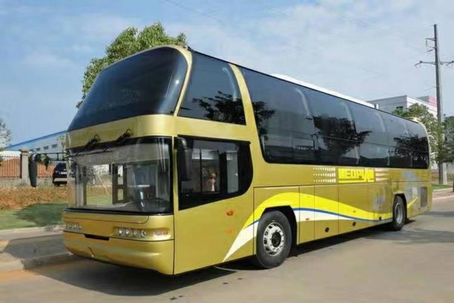

## bike
可拍摄自行车车身，如下图：
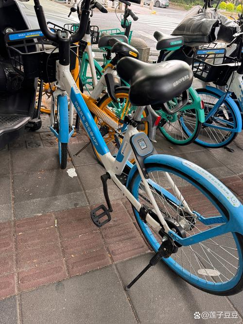

## eleBike
可拍摄电车车身，如下图：
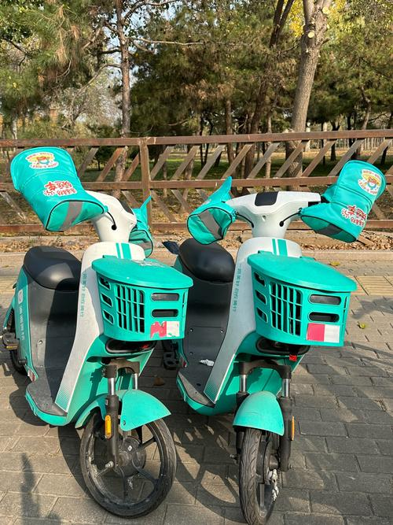

## shopBag
可拍摄环保购物袋，如下图：
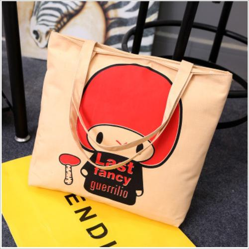

## waterbottle
可拍摄水杯，如下图：
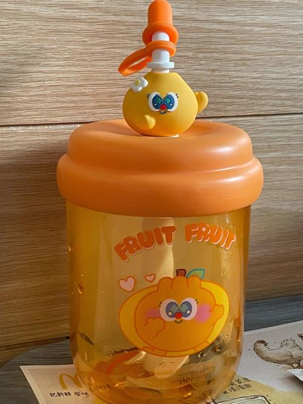

## trash
可拍摄分类垃圾桶，如下图：
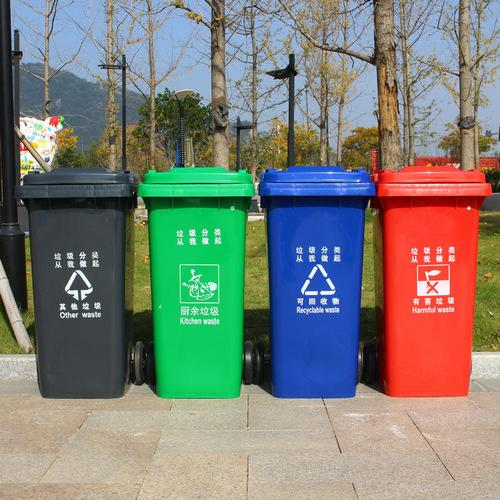

## homePlant
可拍摄家庭种植的观赏性植物/蔬菜水果等，如下图：
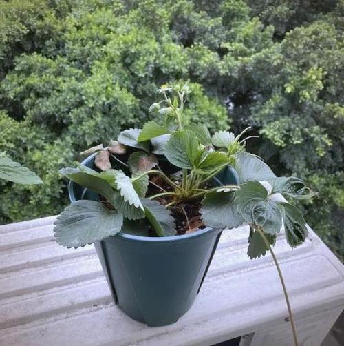

## lunchBox
可拍摄餐盘/保温饭盒/便当盒，如下图：
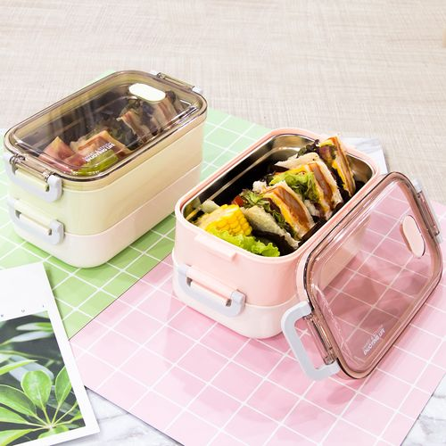

## mac_mini_m4
可拍摄Mac mini(M4)机身，该产品为碳中和电子产品，如下图：
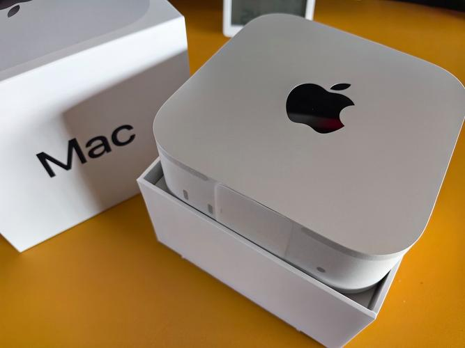

## apple_watch
可拍摄Apple Watch系列机身，该系列产品为碳中和电子产品，如下图：
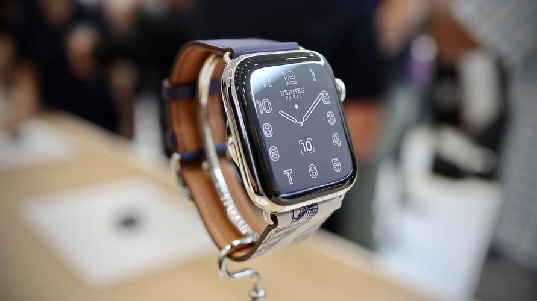

# 图像数据源采集说明
由于版权原因，训练该模型所使用的图片数据不公开。不过可以参考以下方法采集图片：
1.使用**八爪鱼采集器**里的“百度图片”模板，输入关键词后采集图片链接；
2.导出图片链接，使用下载器（比如**JDownloader2**）下载图片；
3.对图片进行清洗，筛选出**主体清晰**的图片；
4.**统一图片数量**，使用**CreateML**训练。

# 模型使用
在遵守**MIT License**的前提下，本模型允许自由修改、分发等行为，使用**请署名**。可以通过右侧的“**Release**”板块下载相应版本的模型，版本号越新越好。

# 版本更新日志
## 2025.6.7 - V2.1
新增了“mac_mini_m4”标签
## 2025.6.7 - V2.2
新增了“apple_watch”标签